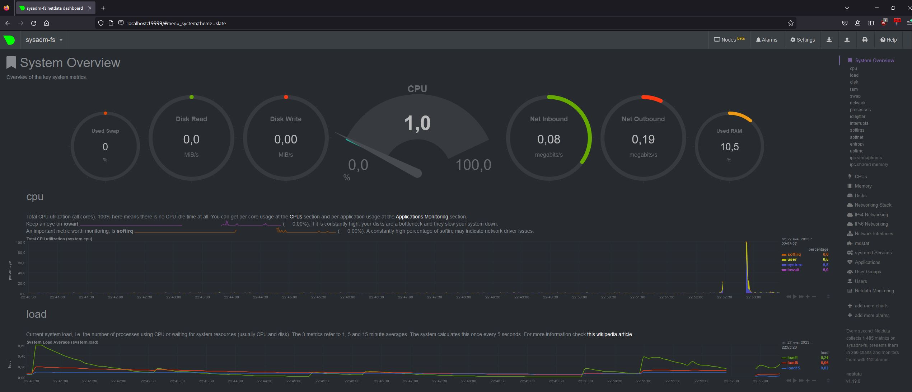

# Домашнее задание к занятию "Операционные системы. Лекция 2"

## 1. На лекции мы познакомились с node_exporter. В демонстрации его исполняемый файл запускался в background. Этого достаточно для демо, но не для настоящей production-системы, где процессы должны находиться под внешним управлением. Используя знания из лекции по systemd, создайте самостоятельно простой unit-файл для node_exporter:

Установил по ману с офф сайта - <https://prometheus.io/docs/guides/node-exporter/>

Далее для создания unit-файла сделал следующее:

      vagrant@sysadm-fs:~/node_exporter-1.5.0.linux-amd64$ sudo mv ./node_exporter /usr/local/bin/
      vagrant@sysadm-fs:/usr/local$ sudo touch /etc/systemd/system/node_exporter.service
      vagrant@sysadm-fs:/usr/local$ sudo vim /etc/systemd/system/node_exporter.service
      [Unit]
      Description=metrics_exporter
      After=network.target
      
      [Service]
      Type=simple
      ExecStart=/usr/local/bin/node_exporter $EXTRA_OPTS
      EnvironmentFile=/usr/local/bin/node_exporter.env
      
      [Install]
      WantedBy=multi-user.target
      vagrant@sysadm-fs:/usr/local/bin$ sudo systemctl start node_exporter

### поместите его в автозагрузку

      vagrant@sysadm-fs:/usr/local/bin$ sudo systemctl enable node_exporter

### предусмотрите возможность добавления опций к запускаемому процессу через внешний файл (посмотрите, например, на systemctl cat cron)

      [Service]
      Type=simple
      ExecStart=/usr/local/bin/node_exporter $EXTRA_OPTS
      EnvironmentFile=/usr/local/bin/node_exporter.env

### удостоверьтесь, что с помощью systemctl процесс корректно стартует, завершается, а после перезагрузки автоматически поднимается

#### проверка запуска

      vagrant@sysadm-fs:/usr/local/bin$ sudo systemctl start node_exporter
      vagrant@sysadm-fs:/usr/local/bin$ sudo systemctl status node_exporter
      ● node_exporter.service - metrics_exporter
           Loaded: loaded (/etc/systemd/system/node_exporter.service; enabled; vendor preset: enabled)
           Active: active (running) since Fri 2023-01-27 19:09:59 UTC; 1s ago
         Main PID: 3092 (node_exporter)
            Tasks: 4 (limit: 2274)
           Memory: 2.3M
           CGroup: /system.slice/node_exporter.service
                   └─3092 /usr/local/bin/node_exporter
      
      Jan 27 19:09:59 sysadm-fs node_exporter[3092]: ts=2023-01-27T19:09:59.352Z caller=node_exporter.go:117 level=info collector=thermal_>
      
#### проверка остановки

      vagrant@sysadm-fs:/usr/local/bin$ sudo systemctl stop node_exporter
      vagrant@sysadm-fs:/usr/local/bin$ sudo systemctl status node_exporter
      ● node_exporter.service - metrics_exporter
           Loaded: loaded (/etc/systemd/system/node_exporter.service; enabled; vendor preset: enabled)
           Active: inactive (dead) since Fri 2023-01-27 19:09:32 UTC; 4s ago
          Process: 3016 ExecStart=/usr/local/bin/node_exporter $EXTRA_OPTS (code=killed, signal=TERM)
         Main PID: 3016 (code=killed, signal=TERM)
      
      Jan 27 19:01:26 sysadm-fs node_exporter[3016]: ts=2023-01-27T19:01:26.784Z caller=node_exporter.go:117 level=info collector=udp_queu

#### проверка что помогла настройка автозагрузки

      PS D:\VM_RDP\Vagrant_learn> vagrant reload
      ==> default: Attempting graceful shutdown of VM...
      ==> default: Checking if box 'bento/ubuntu-20.04' version '202206.03.0' is up to date...
      ==> default: Clearing any previously set forwarded ports...
      ==> default: Clearing any previously set network interfaces...
      ==> default: Preparing network interfaces based on configuration...
          default: Adapter 1: nat
      ==> default: Forwarding ports...
          default: 22 (guest) => 2222 (host) (adapter 1)
      ==> default: Running 'pre-boot' VM customizations...
      ==> default: Booting VM...
      ==> default: Waiting for machine to boot. This may take a few minutes...
          default: SSH address: 127.0.0.1:2222
          default: SSH username: vagrant
          default: SSH auth method: private key
      ==> default: Machine booted and ready!
      ==> default: Checking for guest additions in VM...
      ==> default: Setting hostname...
      ==> default: Mounting shared folders...
          default: /vagrant => D:/VM_RDP/Vagrant_learn
      ==> default: Machine already provisioned. Run `vagrant provision` or use the `--provision`
      ==> default: flag to force provisioning. Provisioners marked to run always will still run.
      PS D:\VM_RDP\Vagrant_learn> vagrant ssh
      Welcome to Ubuntu 20.04.4 LTS (GNU/Linux 5.4.0-110-generic x86_64)
      
       * Documentation:  https://help.ubuntu.com
       * Management:     https://landscape.canonical.com
       * Support:        https://ubuntu.com/advantage
      
        System information as of Fri 27 Jan 2023 07:11:52 PM UTC
      
        System load:  0.22               Processes:             145
        Usage of /:   12.3% of 30.63GB   Users logged in:       0
        Memory usage: 11%                IPv4 address for eth0: 10.0.2.15
        Swap usage:   0%
      
      
      This system is built by the Bento project by Chef Software
      More information can be found at https://github.com/chef/bento
      Last login: Fri Jan 27 18:28:09 2023 from 10.0.2.2
      vagrant@sysadm-fs:~$ sudo systemctl status node_exporter
      ● node_exporter.service - metrics_exporter
           Loaded: loaded (/etc/systemd/system/node_exporter.service; enabled; vendor preset: enabled)
           Active: active (running) since Fri 2023-01-27 19:11:27 UTC; 29s ago
         Main PID: 831 (node_exporter)
            Tasks: 4 (limit: 2274)
           Memory: 14.9M
           CGroup: /system.slice/node_exporter.service
                   └─831 /usr/local/bin/node_exporter
      
      Jan 27 19:11:28 sysadm-fs node_exporter[831]: ts=2023-01-27T19:11:28.231Z caller=node_exporter.go:117 level=info collector=thermal_z>

## 2. Ознакомьтесь с опциями node_exporter и выводом /metrics по-умолчанию. Приведите несколько опций, которые вы бы выбрали для базового мониторинга хоста по CPU, памяти, диску и сети.

CPU:

- system - время, затраченное в ядре;
- user - время, затраченное в пространстве пользователя
- iowait - время затраченное на ожидание i/o

        node_cpu_seconds_total{cpu="0",mode="iowait"} 0.23
        node_cpu_seconds_total{cpu="0",mode="system"} 3.77
        node_cpu_seconds_total{cpu="0",mode="user"} 3.35
        node_cpu_seconds_total{cpu="1",mode="iowait"} 0.44
        node_cpu_seconds_total{cpu="1",mode="system"} 4.75
        node_cpu_seconds_total{cpu="1",mode="user"} 2.32

MEM:

- MemAvailable - доступная память;
- MemFree - свободная память
- SwapCached - кеш свопа, сколько использовали
- SwapFree - свободное место в свопе

        node_memory_MemAvailable_bytes 1.747341312e+09
        node_memory_MemFree_bytes 1.490546688e+09
        node_memory_SwapCached_bytes 0
        node_memory_SwapFree_bytes 2.047864832e+09

DISK:

- filesystem_free_bytes - свободное место;
- filesystem_device_error - показатель есть ли ошибки при сборе статисики с устройства
- node_disk_io_now - количество i/o на устройство

        node_filesystem_free_bytes{device="/dev/mapper/ubuntu--vg-ubuntu--lv",fstype="ext4",mountpoint="/"} 2.8851249152e+10
        node_filesystem_free_bytes{device="/dev/sda2",fstype="ext4",mountpoint="/boot"} 1.436540928e+09
        node_filesystem_free_bytes{device="tmpfs",fstype="tmpfs",mountpoint="/run"} 2.0690944e+08
        node_filesystem_free_bytes{device="tmpfs",fstype="tmpfs",mountpoint="/run/lock"} 5.24288e+06
        node_filesystem_free_bytes{device="tmpfs",fstype="tmpfs",mountpoint="/run/snapd/ns"} 2.0690944e+08
        node_filesystem_free_bytes{device="tmpfs",fstype="tmpfs",mountpoint="/run/user/1000"} 2.07945728e+08
        node_filesystem_free_bytes{device="vagrant",fstype="vboxsf",mountpoint="/vagrant"} 2.08317837312e+11
        node_filesystem_device_error{device="/dev/mapper/ubuntu--vg-ubuntu--lv",fstype="ext4",mountpoint="/"} 0
        node_filesystem_device_error{device="/dev/sda2",fstype="ext4",mountpoint="/boot"} 0
        node_filesystem_device_error{device="tmpfs",fstype="tmpfs",mountpoint="/run"} 0
        node_filesystem_device_error{device="tmpfs",fstype="tmpfs",mountpoint="/run/lock"} 0
        node_filesystem_device_error{device="tmpfs",fstype="tmpfs",mountpoint="/run/snapd/ns"} 0
        node_filesystem_device_error{device="tmpfs",fstype="tmpfs",mountpoint="/run/user/1000"} 0
        node_filesystem_device_error{device="vagrant",fstype="vboxsf",mountpoint="/vagrant"} 0
        node_disk_io_now{device="dm-1"} 0
        node_disk_io_now{device="md126"} 0
        node_disk_io_now{device="md127"} 0
        node_disk_io_now{device="sda"} 0
        node_disk_io_now{device="sdb"} 0
        node_disk_io_now{device="sdc"} 0

NET:

- network_receive_packets_total - количество полученных пакетов;
- network_receive_drop_total - есть ли дропы, их количество
- network_speed_bytes - скорость передачи по сети

        node_network_receive_packets_total{device="eth0"} 887
        node_network_receive_packets_total{device="lo"} 525
        node_network_receive_drop_total{device="eth0"} 0
        node_network_receive_drop_total{device="lo"} 0
        node_network_speed_bytes{device="eth0"} 1.25e+08

## 3. Установите в свою виртуальную машину Netdata. Воспользуйтесь готовыми пакетами для установки (sudo apt install -y netdata)

### в конфигурационном файле /etc/netdata/netdata.conf в секции [web] замените значение с localhost на bind to = 0.0.0.0,

      [global]
              run as user = netdata
              web files owner = root
              web files group = root
              # Netdata is not designed to be exposed to potentially hostile
              # networks. See https://github.com/netdata/netdata/issues/164
              bind socket to IP = 0.0.0.0

### добавьте в Vagrantfile проброс порта Netdata на свой локальный компьютер и сделайте vagrant reload

       Vagrant.configure("2") do |config|
           config.vm.box = "bento/ubuntu-20.04"
           config.vm.hostname=host_params['hostname']
           config.vm.provider :virtualbox do |v|
       
               v.name=host_params['vm_name']
               v.cpus=host_params['cpus']
               v.memory=host_params['memory']
       
               host_params['disks'].each do |disk|
                   file_to_disk=path_to_disk_folder+'/disk'+disk.to_s+'.vdi'
                   unless File.exist?(file_to_disk)
                       v.customize ['createmedium', '--filename', file_to_disk, '--size', host_params['disk_size']]
                   end
                   v.customize ['storageattach', :id, '--storagectl', 'SATA Controller', '--port', disk.to_s, '--device', 0, '--type', 'hdd',        '--medium', file_to_disk]
               end
           end
           config.vm.network "forwarded_port", guest: 19999, host: 19999
       end

## 4. Можно ли по выводу dmesg понять, осознает ли ОС, что загружена не на настоящем оборудовании, а на системе виртуализации?

Можно

       vagrant@sysadm-fs:~$ dmesg | grep KVM
       [    0.000000] Hypervisor detected: KVM
       [    0.073488] Booting paravirtualized kernel on KVM

## 5. Как настроен sysctl fs.nr_open на системе по-умолчанию? Определите, что означает этот параметр. Какой другой существующий лимит не позволит достичь такого числа (ulimit --help)?